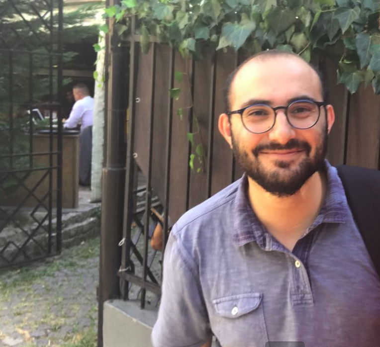
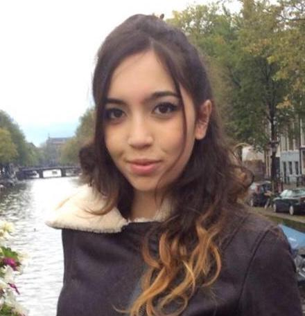
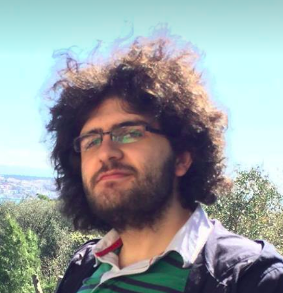
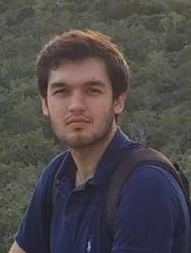
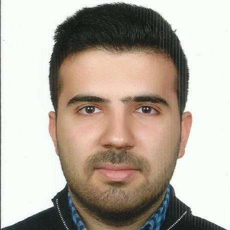

  
  
<strong><a href="https://www.cmpe.boun.edu.tr/~emre/index.html">Emre Ugur</a></strong>
 
Head of Research Group
  

<strong>PhD Students</strong>
 

  

    <a href="https://serkanbugur.github.io/">
  
  
Serkan Bugur

</a>
  

  

    <a href="https://alper111.github.io/">
  
  
Alper Ahmetoglu

</a>
  

  

  
  
Ece Ada

  

<strong>MSc Students</strong>
 

  

    <a href="https://scholar.google.com/citations?user=H8NkqvQAAAAJ&hl=tr">
  
  
M. Yunus Seker

</a>
  

  

    <a href="https://github.com/Fzaero">
  
  
Ahmet Tekden

</a>
  

  

    <a href='https://melsener.github.io'>
  
  
Melisa Sener

</a>
  

  

  
  
Tuluhan Akbulut

  

  

    <a href='https://github.com/Hbasgol'>
  
  
Hamit Basgol

</a>
  

  

    <a href='https://github.com/UtkuBozdogan'>
  
  
Utku Bozdogan

</a>
  

<strong>Former Members</strong>
 

<table class="inline">
	<tbody>
    <tr class="row0">
		<th class="col0 leftalign" style='background:none'> <a href="https://mertimre.github.io/" class="urlextern" title="https://mertimre.github.io/" rel="nofollow">Mert Imre</a> </th><th class="col1 centeralign" style='background:none; color:black;'>  2016-2019    </th>
	</tr>
    <tr class="row0">
		<th class="col0 leftalign" style='background:none'> <a href="http://www.idiap.ch/~hgirgin/" class="urlextern" title="http://www.idiap.ch/~hgirgin/" rel="nofollow">Hakan Girgin</a> </th><th class="col1 centeralign" style='background:none; color:black;'>  2016-2018    </th>
	</tr>
    <tr class="row0">
		<th class="col0 leftalign" style='background:none'> <a href="https://github.com/cagirici" class="urlextern" title="https://github.com/cagirici" rel="nofollow">Erhan Cagirici</a> </th><th class="col1 centeralign" style='background:none; color:black;'>  2016-2018    </th>
	</tr>
</tbody></table>

<strong>Interns</strong>
 

<table class="inline">
	<tbody>
    <tr class="row0">
		<th class="col0 leftalign" style='background:none'> <a href="https://scholar.google.com.tr/citations?user=oZkaOigAAAAJ&hl=en" class="urlextern" title="https://scholar.google.com.tr/citations?user=oZkaOigAAAAJ&hl=en" rel="nofollow">Emir Arditi</a> </th><th class="col1 centeralign" style='background:none; color:black;'>  2018 Summer    </th>
	</tr>
    <tr class="row0">
		<th class="col0 leftalign" style='background:none'> <a href="https://github.com/bilgehannal" class="urlextern" title="https://github.com/bilgehannal" rel="nofollow">Bilgehan Nal</a> </th><th class="col1 centeralign" style='background:none; color:black;'>  2017 Summer    </th>
	</tr>
</tbody></table>
